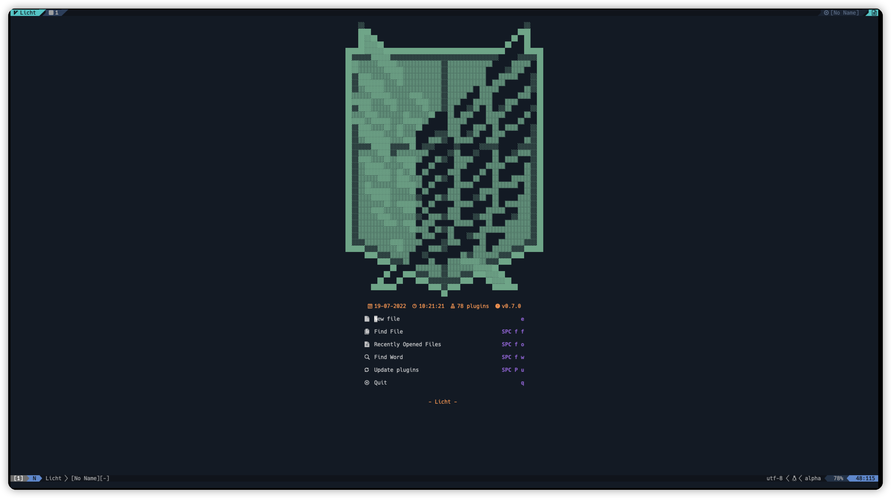
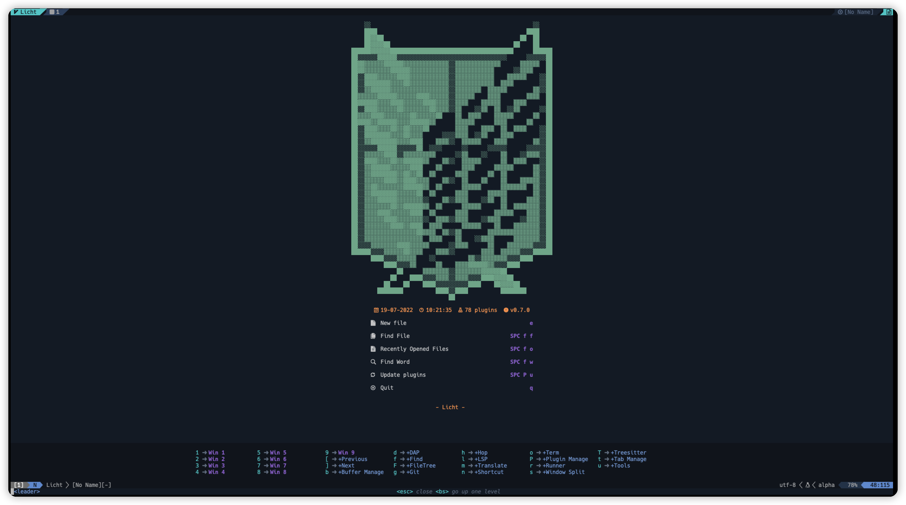
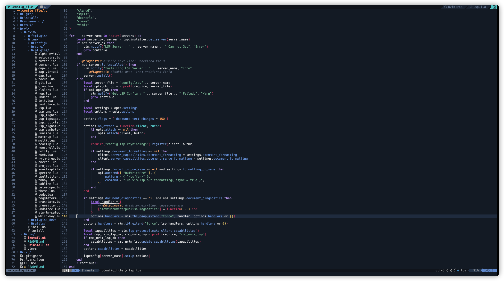
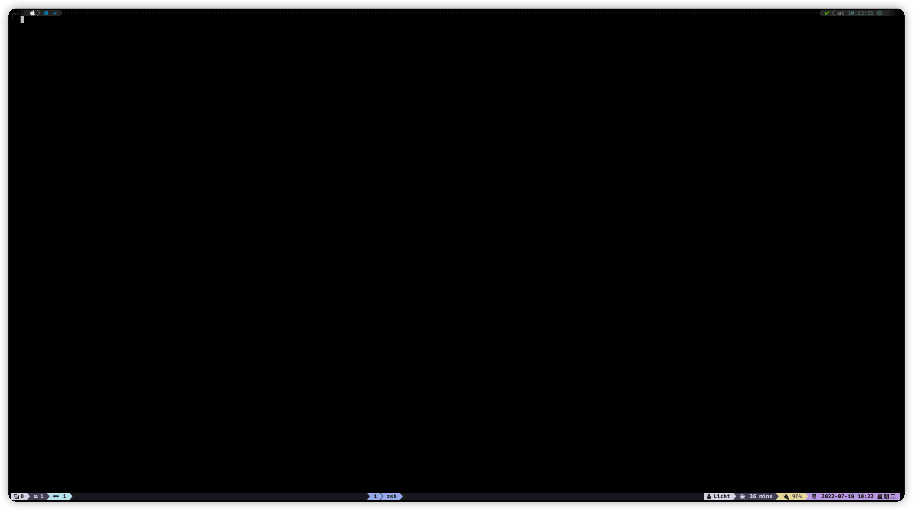

# 我的 Vim 及命令行配置

- shi适用于 macos 及 ubuntu

----

- 包含 zsh、tmux、vim

## 效果图

----

- [tmux 说明](./tmux/README.md)

- [zsh 说明](./zsh/README.md)

- [vim && Neovim 说明](./vi/README.md)

- [安装的软件](./install/README.md)
