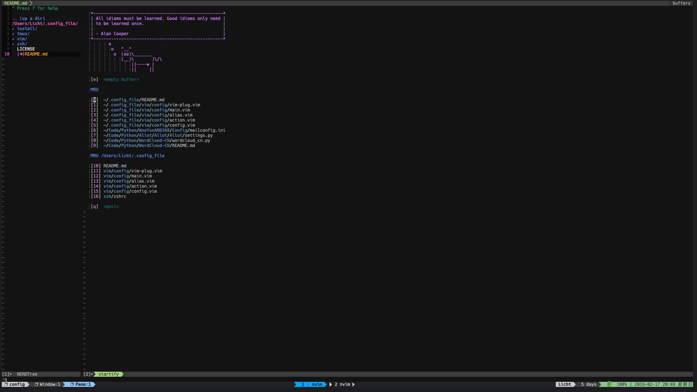
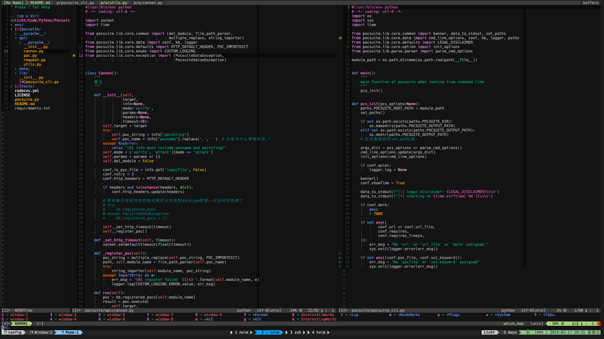

# 我的 Vim 及命令行配置

* 基于 macos 平台

----

- 包含 zsh、tmux、vim

## 效果图

> tmux 及 vim

> vim 编辑 Python 文件

----

- [tmux 说明](./tmux/README.md)

- [zsh 说明](./zsh/README.md)

- [vim 说明](./vim/README.md)

- [安装的软件](./install/README.md)
